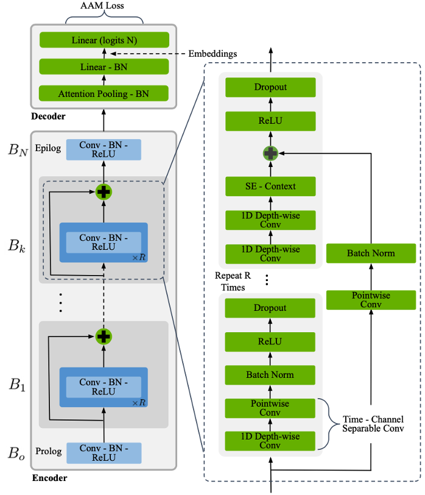
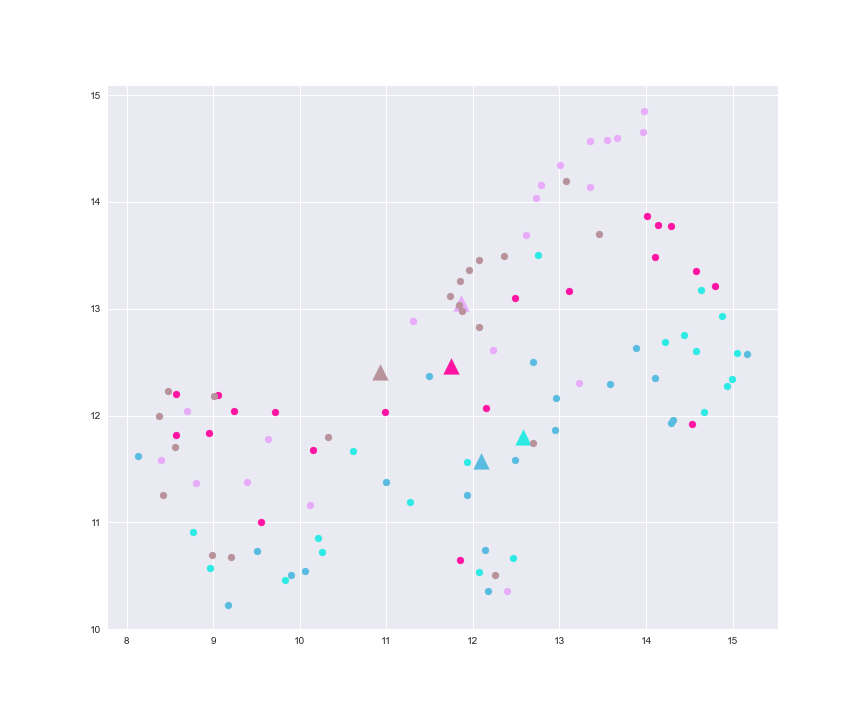
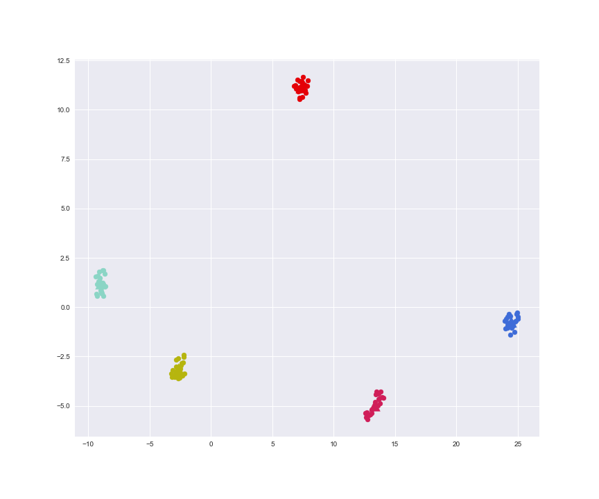
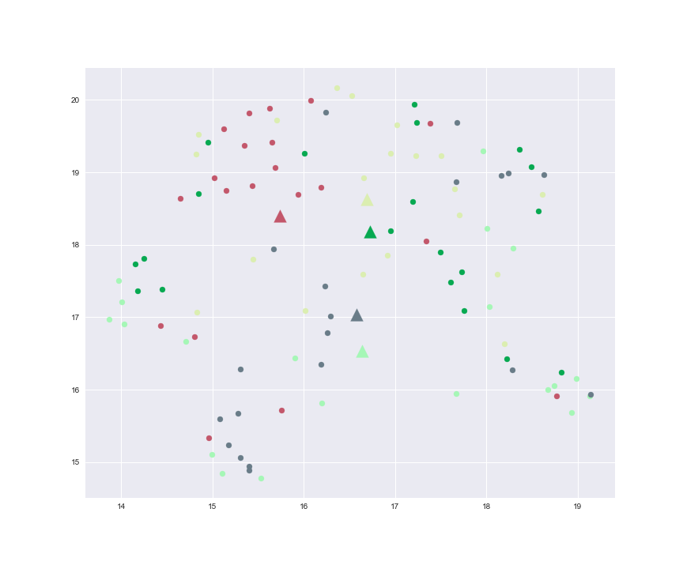
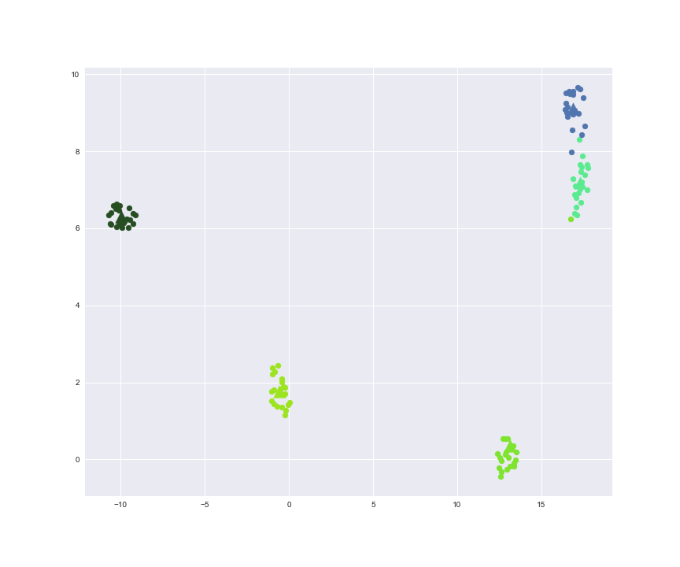
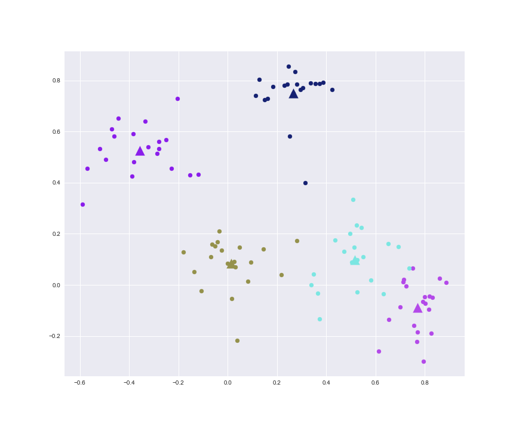
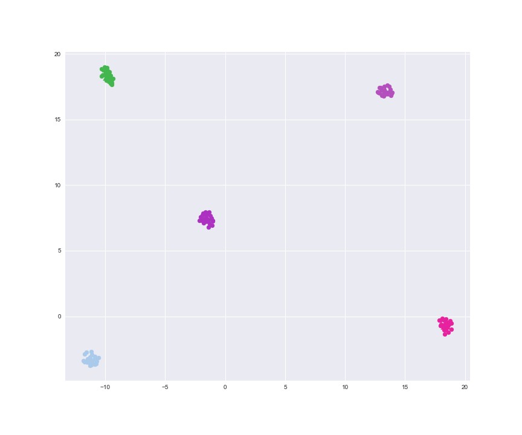

# TitaNet

<p align="center">
	
</p>

This repository contains a small scale implementation of the following paper:

```
TitaNet: Neural Model for speaker representation with 1D Depth-wise separable convolutions and global context,
Nithin Rao Koluguri, Taejin Park, Boris Ginsburg,
https://arxiv.org/abs/2110.04410.
```

It is "small scale" because we only rely on the LibriSpeech dataset, instead of using VoxCeleb1, VoxCeleb2, SRE, Fisher, Switchboard and LibriSpeech, as done in the original work. The main reason for this choice is related to resources, as the combined dataset has 3373 hours of speech, with 16681 speakers and 4890K utterances, which is quite big to be trained on Google Colab. Instead, the LibriSpeech subset that we consider has about 100 hours of speech, with 251 speakers and 28.5K utterances, which is sufficient to test the capabilities of the model. Moreover, we only test TitaNet on the speaker identification and verification tasks, instead of also testing it on speaker diarization.

## Installation

In order to install all the dependencies required by the project, you need to make sure to have `Python 3.9` installed on your system. Then, run the following commands to create a virtual environment and install the required libraries.

```bash
python3 -m venv venv
source venv/bin/activate
pip install -r init/requirements.txt
```

## Execution

Both training and testing parts of the project are managed through a Jupyter notebook ([titanet.ipynb](titanet.ipynb)). The notebook contains a broad analysis of the dataset in use, an explanation of all the data augmentation techniques reported in the paper, a description of the baseline and TitaNet models and a way to train and test them. Hyper-parameters are handled via the `parameters.yml` file. To run the Jupyter notebook, execute the following command:

```bash
jupyter notebook titanet.ipynb
```

If you just want to train a model from scratch, you can directly rely on the `train.py` module, which can be called in the following way:

```bash
python3 src/train.py -p "./parameters.yml"
```

Training and evaluation metrics, along with model checkpoints and results, are directly logged into a W&B project, which is openly accessible [here](https://wandb.ai/wadaboa/titanet). In case you want to perform a custom training run, you have to either disable W&B (see `parameters.yml`) or provide your own entity (your username), project and API key file location in the `parameters.yml` file. The W&B API key file is a plain text file that contains a single line with your W&B API key, that you can get from [here](https://wandb.ai/authorize).

## Results

This section shows some visual results obtained after training each embedding model for around 75 epochs. Please note that all figures represent the same set of utterances, even though different figures use different colours for the same speaker.

### Baseline vs TitaNet on LibriSpeech

This test compares the baseline and TitaNet models on the LibriSpeech dataset used for training. Both models were trained with cross-entropy loss and 2D projections were performed with UMAP. As we can see, the good training and validation metrics of the baseline model are not mirrored in this empirical test. Instead, TitaNet is able to form compact clusters of utterances, thus reflecting the high performance metrics obtained during training.

Baseline             |  TitaNet
:-------------------------:|:-------------------------:
  |  

### Baseline vs TitaNet on VCTK

This test compares the baseline and TitaNet models on the VCTK dataset, unseen during training. Both models were trained with cross-entropy loss and 2D projections were performed with UMAP. As above, TitaNet beats the baseline model by a large margin.

Baseline             |  TitaNet
:-------------------------:|:-------------------------:
  |  

### SVD vs UMAP reduction

This test compares two 2D reduction methods, namely SVD and UMAP. Both figures rely on the TitaNet model trained with cross-entropy loss. As we can see, the choice of the reduction method highly influences our subjective evaluation, with UMAP giving much better separation in the latent space.

TitaNet LS SVD             |  TitaNet LS UMAP
:-------------------------:|:-------------------------:
  |  

### Cross-entropy vs ArcFace loss

This test compares two TitaNet models, one trained with cross-entropy loss and the other one trained with ArcFace loss. Both figures rely on UMAP as their 2D reduction method. As we can see, there doesn't seem to be a winner in this example, as both models are able to obtain good clustering properties.

Cross-entropy           |  ArcFace
:-------------------------:|:-------------------------:
  |  
