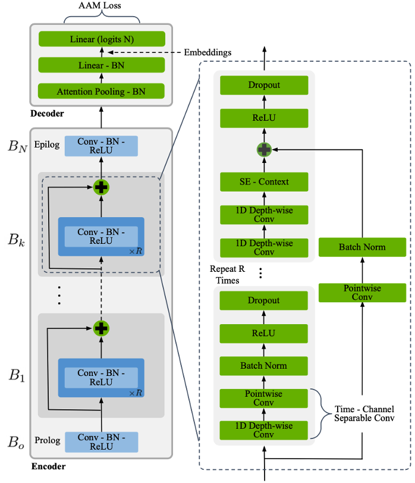

# TitaNet

<p align="center">
	
</p>

This repository contains a small scale implementation of the following paper:

```
TitaNet: Neural Model for speaker representation with 1D Depth-wise separable convolutions and global context,
Nithin Rao Koluguri, Taejin Park, Boris Ginsburg,
https://arxiv.org/abs/2110.04410.
```

It is "small scale" because we only rely on the LibriSpeech dataset, instead of using VoxCeleb1, VoxCeleb2, SRE, Fisher, Switchboard and LibriSpeech, as done in the original work. The main reason for this choice is related to resources, as the combined dataset has 3373 hours of speech, with 16681 speakers and 4890K utterances, which is quite big to be trained on Google Colab. Instead, LibriSpeech has 336 hours of speech, with 2338 speakers and 634K utterances, which is sufficient to test the capabilities of the model. Moreover, we only test TitaNet on the speaker identification task, instead of testing it on speaker verification and diarization.

## Installation

In order to install all the dependencies required by the project, you need to make sure to have `Python 3.9` installed on your system. Then, run the following commands to create a virtual environment and install the required libraries.

```bash
python3 -m venv venv
source venv/bin/activate
pip install -r init/requirements.txt
```

## Execution

Both training and testing parts of the project are managed through a Jupyter notebook ([titanet.ipynb](titanet.ipynb)). The notebook contains a broad analysis of the dataset in use, an explanation of all the data augmentation techniques reported in the paper, a description of the TitaNet model and a way to train and test it. Hyper-parameters are handled via the `parameters.yml` file. To run the Jupyter notebook, execute the following command:

```bash
jupyter notebook titanet.ipynb
```

If you just want to train a model from scratch, you can directly rely on the `train.py` module, which can be called in the following way:

```bash
python3 src/train.py -p "./parameters.yml"
```

Training and evaluation metrics, along with model checkpoints and results, are directly logged into a W&B project, which is openly accessible [here](https://wandb.ai/wadaboa/titanet). In case you want to perform a custom training run, you have to either disable W&B (see `parameters.yml`) or provide your own entity (your username), project and API key file location in the `parameters.yml` file. The W&B API key file is a plain text file that contains a single line with your W&B API key, that you can get from [here](https://wandb.ai/authorize).

Currently, training and testing on Google Colab is only allowed to the repository owner, as it relies on a private SSH key to clone this Github repo. Please open an issue if your use case requires you to work on Google Colab.
